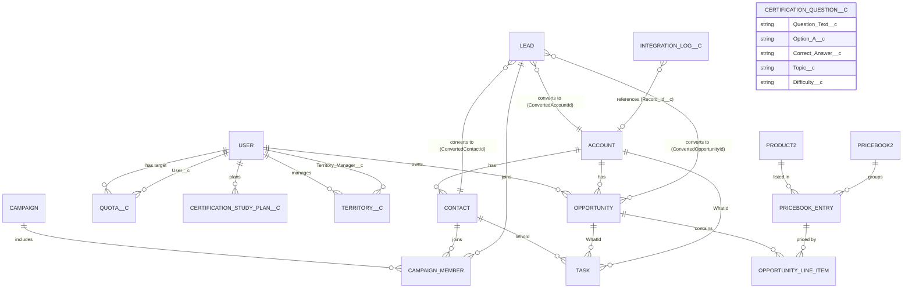
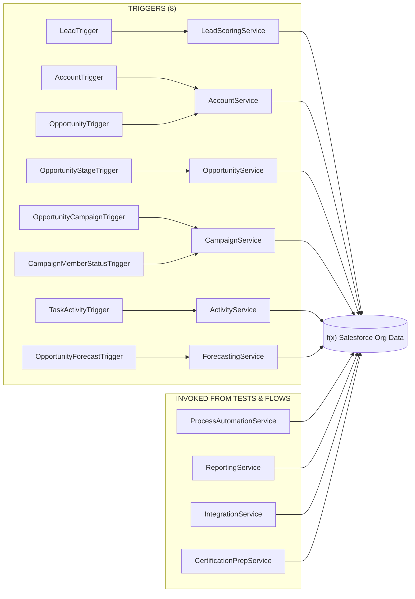
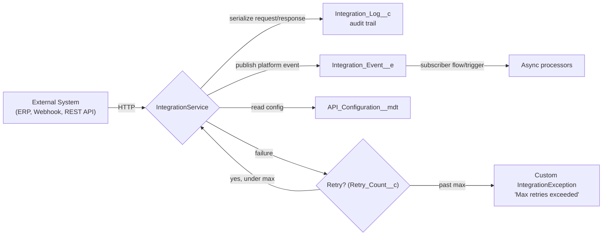
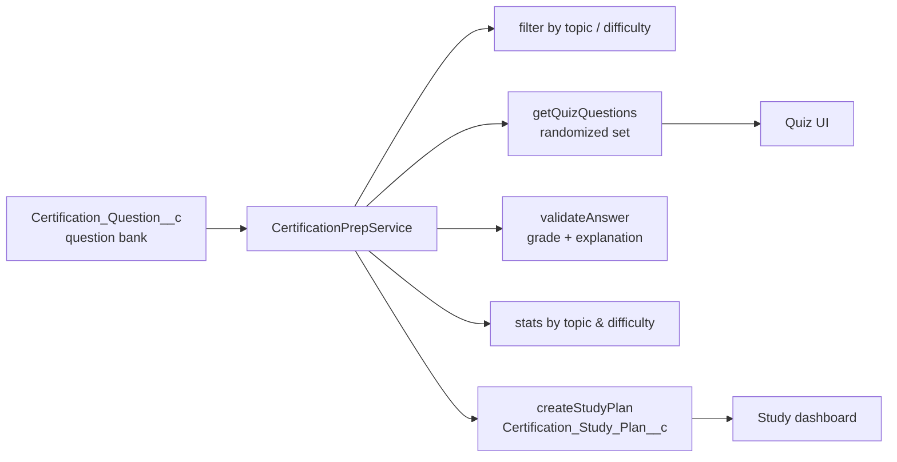

# 🏗️ Sales Cloud RoadMap — Architecture

This document is a visual walkthrough of the system built across the 11 phases. All diagrams are [Mermaid](https://mermaid.js.org) and render natively on GitHub.

---

## 1. High-Level Architecture (Layered)

The project follows a **layered architecture**: Lightning Experience on top, automation in the middle, an Apex service layer doing the business logic, and clean, normalized data underneath.

```mermaid
flowchart TB
    subgraph UI["PRESENTATION"]
        UX["Lightning Experience — Sales Cloud App"]
        DSB["Reports (7) & Dashboards (4)"]
        QUIZ["Certification Prep — Question Bank UI"]
    end

    subgraph AUTOMATION["AUTOMATION LAYER"]
        F[Flows (9)<br/>scoring, follow-ups, nurture, chatter, stale-close]
        VR[Validation Rules (6)<br/>stage guards, closed-deal locks, lead contact info]
        AR[Assignment Rules<br/>industry → queue routing]
        AP[Approval Process<br/>Opportunity discount approval]
    end

    subgraph APEX["APEX LAYER (business logic)"]
        TRIGGERS["8 Triggers<br/>Lead, Account, Opportunity x3, CampaignMember, Task, Forecast"]
        SERVICES["10 Service Classes<br/>Scoring, Account, Opportunity, Campaign, Activity,<br/>Process Automation, Forecasting, Reporting, Integration, Certification"]
        AI["Integration_Event__e<br/>Platform Event"]
        CMT["API_Configuration__mdt<br/>Custom Metadata"]
    end

    subgraph DATA["DATA LAYER"]
        STD["Standard Objects<br/>Account, Contact, Lead, Opportunity, Campaign,<br/>Task, Event, User, CampaignMember"]
        CUSTOM["Custom Objects<br/>Quota__c, Territory__c, Integration_Log__c,<br/>Certification_Question__c, Certification_Study_Plan__c"]
    end

    UX --> F
    UX --> VR
    UX --> AR
    UX --> AP

    F --> SERVICES
    VR --> DATA
    AR --> DATA
    AP --> SERVICES

    UX --> TRIGGERS
    TRIGGERS --> SERVICES
    SERVICES --> DATA

    SERVICES --> AI
    AI --> CMT

    DSB --> SERVICES
    QUIZ --> SERVICES
    QUIZ --> CUSTOM

    DATA --> DSB
    DATA --> QUIZ
```

> **Architecture principles used throughout:**
> - **Trigger-light / Service-heavy**: triggers only detect events; all logic lives in testable service classes.
> - **Bulk-safe**: every trigger iterates `Trigger.new` lists, never `for` loops with per-record DML.
> - **`with sharing`**: services enforce the security model.
> - **Test-isolated**: every service has a `@isTest` companion using `@TestSetup`.

---

## 2. Data Model

Salesforce standard objects + the 5 custom objects and their relationships. Custom fields extend each standard object (e.g. `Health_Score__c` on Account, `Lead_Score__c` on Lead).



**Custom objects & their purpose:**

| Custom Object | Purpose | Used By |
|---------------|---------|---------|
| `Quota__c` | Sales targets (user + amount + period) | `ForecastingService` |
| `Territory__c` | Territory definitions (region, manager) | `ForecastingService` |
| `Integration_Log__c` | Audit trail for every API call | `IntegrationService` |
| `Certification_Question__c` | Mini question bank | `CertificationPrepService` |
| `Certification_Study_Plan__c` | User study plans on custom objects | `CertificationPrepService` |
| `Integration_Event__e` (platform event) | Asynchronous integration notification | `IntegrationService` |
| `API_Configuration__mdt` (custom metadata) | Read-only API endpoint config | `IntegrationService` |

---

## 3. Trigger → Service Wiring

Every trigger delegates to exactly one service — no logic lives inside a trigger.



> **Note:** `ProcessAutomationService`, `ReportingService`, `IntegrationService` and `CertificationPrepService` are orchestrated services — invoked from Flows, scheduled automation, or Apex tests rather than object triggers.

---

## 4. End-to-End Sales Process Flow

How a lead becomes a won opportunity, forecast-worthy revenue, and a KPI on a dashboard.

```mermaid
flowchart TD
    A[Lead captured] --> B[LeadTrigger scores + rates<br/>LeadScoringService]
    B --> C[Assignment Rules route<br/>to industry queue]
    C --> D[Lead conversion<br/>→ Account + Contact + Opportunity]
    D --> E[OpportunityStageTrigger<br/>sets close date, opens tasks]
    E --> F{Stage management}
    F -->|campaign influence| G[OpportunityCampaignTrigger<br/>adds contacts to campaign]
    F -->|time passes| H[ProcessAutomationService<br/>auto-closes stale deals]
    F -->|big discount| I[Approval Process<br/>discount sign-off]
    F -->|high value| J[TaskActivityTrigger<br/>follow-ups + Chatter]
    G --> K{CampaignService}<br/>ROI & influence metrics
    F --> L[Won / Lost]
    L -->|Won| M[AccountService rolls up<br/>revenue onto Account]
    M --> N[ForecastingService<br/>quota attainment + weighted forecast]
    N --> O[ReportingService<br/>territory revenue, win rate, funnel]
    O --> P[Reports + Dashboards]
```

---

## 5. Integration Architecture (Phase 10)



---

## 6. Certification Prep Architecture (Phase 11)



---

## 7. Folder → Architectural Layer Mapping

| Roadmap folder | Layer |
|----------------|-------|
| `force-app/main/default/classes/` | Apex service + test classes |
| `force-app/main/default/triggers/` | Event detection (thin) |
| `force-app/main/default/flows/` | Declarative automation |
| `force-app/main/default/objects/` | Data model (fields, validation rules) |
| `force-app/main/default/approvalProcesses/` | Human-in-the-loop approvals |
| `force-app/main/default/assignmentRules/` | Routing (queues) |
| `force-app/main/default/reports/` + `dashboards/` | Analytics |
| `force-app/main/default/platformEvents/` + `customMetadata/` | Integration substrate |
| `force-app/main/default/permissionsets/` | Security / FLS |
| `salesCloud Roadmap/` | Curriculum (11 phase guides) |
| `scripts/soql/` | Practice queries per phase |